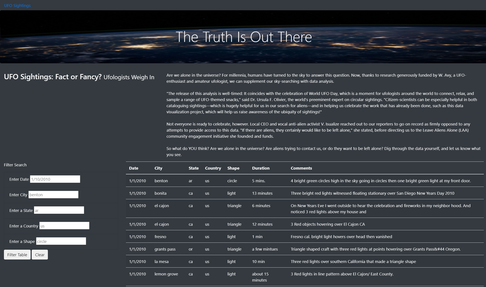
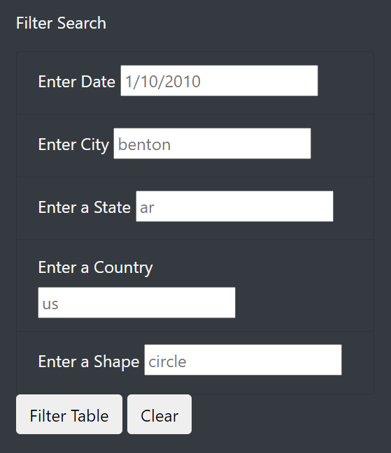

# **UFOs**
Build an user-interative website where users are allowed to filter for multiple criteria at the same time. The criteria include date, city, state, country, and shape.

## Overview of Project
In this project, we built a table using data stored in a Javascript array. A number of filters were created to make the table fuly dynamic, and then place the table into a HTML file for easy viewing. Then, I used Bootstrap to customize the webpage.
## Results

 The filter table allows website visitors to filter the table on the five criteria: date, city, state, country and shape. They are able to type in the specific criteria and click filter table, the table will be filtered according to the criteria.

## Drawbacks and Recommendations
-There are no instructions on using the filter table. Website visitors may have no ideas what the table is about.
  -A short description could be written beside the filter table.
  -It could be better to capitalize city, state and country names, so the table looks more formal.
